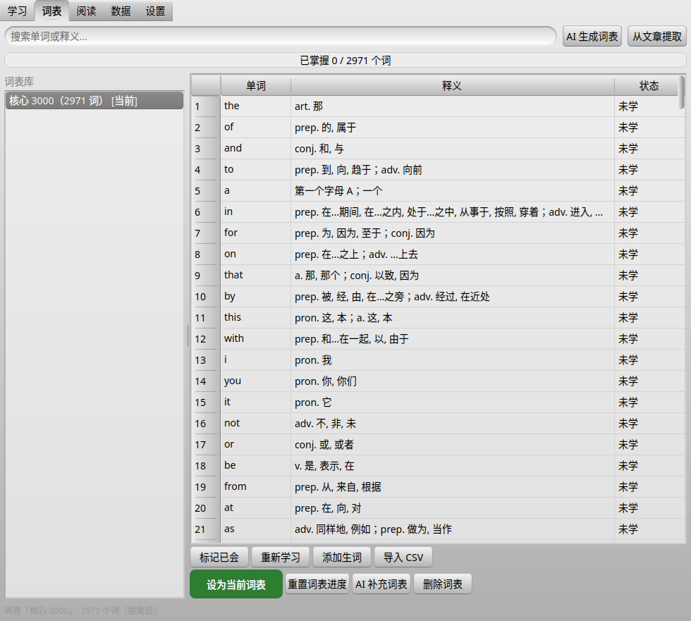
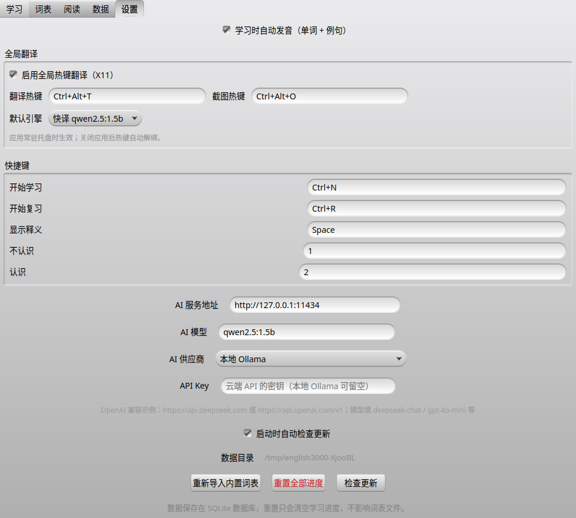

# English 3000

**本地优先 · AI 生成内容 · 免费开源的英语学习工具**

English 3000 是一套以“词表即学习对象”为核心的英语学习软件：选一个词表，
学习页就学这个词表；阅读、翻译、AI 生成的文章和生词收集全部围绕词表闭环，
数据存在本地，AI 可以完全离线运行。

[](LICENSE)


## 截图

| 学习                                    | 阅读                                   |
| --------------------------------------- | -------------------------------------- |
|      |   |
| 词表                                    | 设置                                   |
|  |  |

## 功能亮点

- **词表即书**：选中哪个词表，学习页就学哪个；每本词表独立记录
  未学 / 待复习 / 已掌握进度，无每日上限
- **学习 + 复习**：学习=没学过的词；点“不认识”自动进入复习队列；
  认识/不认识一键切换，可随时返回
- **AI 原生内容**：本地小模型自动生成例句、领域词表、分级阅读文章；
  也支持任意 OpenAI 兼容云端 API（DeepSeek、通义、GLM、Kimi 等）
- **阅读高亮**：红色=未入词表、蓝色=其他词表、绿色=当前词表、黑色=已掌握；
  左键点词发音、选中一段右键朗读、点词加入阅读词表
- **翻译联动**：全局热键小窗翻译 + 截图翻译，生词自动收进「翻译生词」词表
- **完全离线可选**：Windows 一键安装包内置 llama.cpp + Qwen2.5 1.5B 模型，
  CUDA → Vulkan → CPU 三级自动回退，装完即用、无需联网
- **应用内更新**：检查到新版本后点“立即更新”，自动下载、校验、安装、重启
- **跨平台**：Windows / Linux / Android 同一套 C++/Qt 代码

## 快速开始

### Windows

- 一键安装包（内置本地 AI 小模型，推荐新手）：[English3000-OneClick-Setup.exe](https://github.com/lianghanbin/english3000/releases/download/win-oneclick/English3000-OneClick-Setup.exe)
- 绿色版（不带模型，需自备 AI 服务）：[english3000-windows.zip](https://github.com/lianghanbin/english3000/releases/download/win-latest/english3000-windows.zip)

### Android

下载 APK 安装：[english3000-mobile.apk](https://github.com/lianghanbin/english3000/releases/download/android-latest/english3000-mobile.apk)
（AI 服务地址在设置页配置，可填局域网内的模型服务或云端 API）

### Linux

```bash
git clone https://github.com/lianghanbin/english3000.git
cd english3000
cmake -B build -G Ninja -DCMAKE_BUILD_TYPE=Release
cmake --build build
./build/english3000
```

依赖：g++、CMake、Qt 6（Widgets + Sql + Network，Debian 装 `qt6-base-dev` 即可）。
AI 功能需要本机 ollama 服务或 OpenAI 兼容接口（默认 `http://127.0.0.1:11434`，
模型 `qwen2.5:1.5b`，可在设置页修改）。

## 构建与测试

```bash
cmake -B build -G Ninja -DCMAKE_BUILD_TYPE=Release
cmake --build build
./build/test_core   # 核心逻辑单元测试
```

首次启动会自动导入 `assets/oxford3000.csv`（2971 个词）并默认选中
“核心 3000”词表，同时导入词形表（`lemma.en.txt`）和 3 篇示例文章。

## 快捷键（全部可自定义）

| 按键       | 默认作用         |
| ---------- | ---------------- |
| Ctrl+N     | 学习未学的单词   |
| Ctrl+R     | 复习不认识的单词 |
| Space      | 显示释义         |
| 1 / 2      | 不认识 / 认识    |
| Ctrl+Alt+T | 全局翻译小窗     |
| Ctrl+Alt+O | 截图翻译         |

## 项目结构

```text
src/               桌面端 C++ 源码（核心逻辑 + Qt Widgets 界面）
mobile/            Android 移动端（Qt Quick/QML + 同一核心）
tools/             一键安装包脚本（Inno Setup）
assets/            内置词表、词形表与图标
docs/              文档（含鸿蒙适配说明）
```

## 更新机制

每次推送到 main 分支，CI 自动构建并发布 Windows / Android 包，
同时生成版本清单。软件启动后自动检查更新，发现新版本可一键更新。

## 许可证

本项目以 **GPL-3.0** 协议开源：你可以自由使用、修改、分发，
但修改后的版本必须同样以 GPL 协议开源，并保留版权声明。
完整条款见 [LICENSE](LICENSE)。

## 鸿蒙（规划中）

代码层已为 HarmonyOS 适配做好准备，实际出包需要 DevEco Studio、
华为开发者账号与 Qt for HarmonyOS 工具链，详见
[docs/harmonyos.md](docs/harmonyos.md)。
